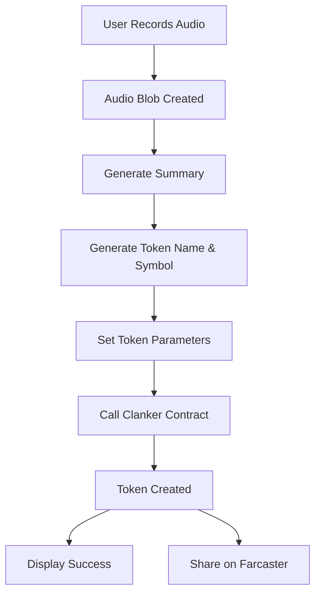
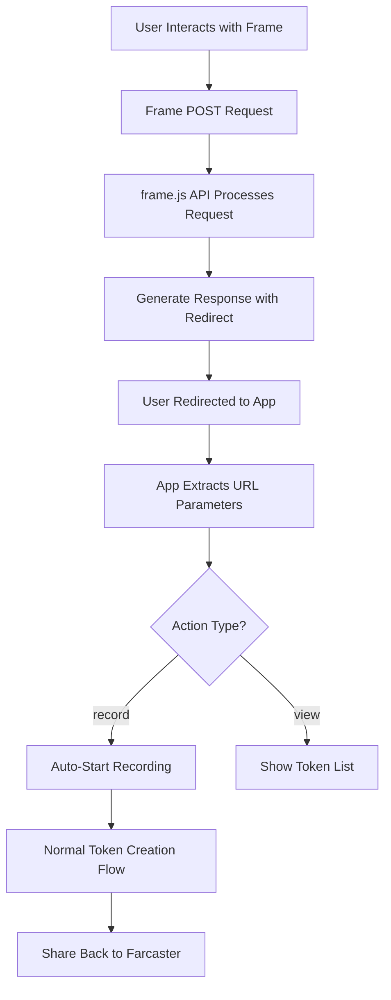
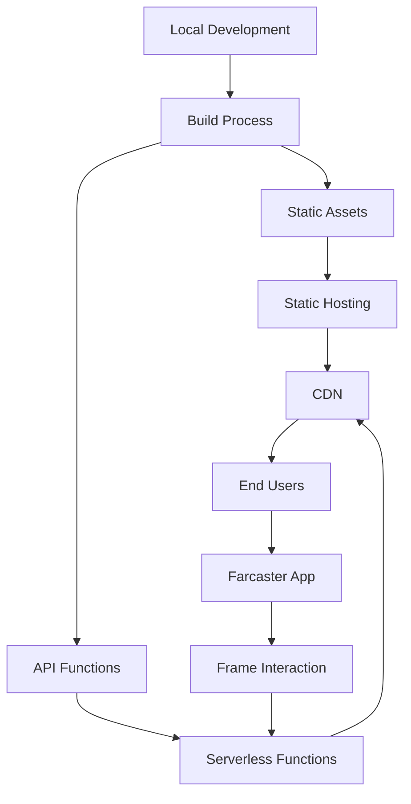
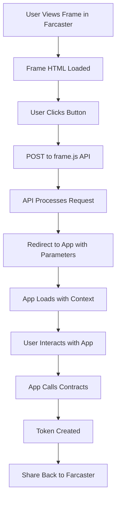

# Audio Token Minter - System Patterns

## Architecture Patterns

### Component-Based Architecture
The application follows a component-based architecture using React. Each component is responsible for a specific part of the functionality:

- **App Component**: Overall application structure and layout
- **ConnectMenu Component**: Wallet connection handling
- **AudioRecorder Component**: Audio recording functionality
- **AudioTokenMinter Component**: Token creation functionality with Clanker
- **TokenList Component**: Display and management of created tokens

This separation of concerns makes the code more maintainable and easier to understand.

### Farcaster Frame Architecture
The application implements the Farcaster Frame architecture for integration with the Farcaster ecosystem:

- **frame.html**: Static HTML file with Farcaster Frame metadata
- **frame.js**: API endpoint for handling frame interactions
- **URL Parameter Parsing**: Extracting Farcaster parameters from URL
- **Action-Based Routing**: Different app behaviors based on frame actions

### Container/Presentational Pattern
The application uses a variation of the container/presentational pattern:

- **Container Components**: Handle state management and business logic (e.g., AudioTokenMinter)
- **Presentational Components**: Focus on rendering UI based on props (e.g., parts of the AudioRecorder)

### Hooks Pattern
React hooks are used extensively throughout the application for state management and side effects:

- **useState**: For local component state
- **useEffect**: For side effects like initializing the SDK and cleaning up resources
- **useRef**: For maintaining references to objects like the MediaRecorder
- **Custom Hooks**: From Wagmi for wallet interactions

## State Management

### Local Component State
Each component manages its own state using React's `useState` hook:

- **AudioRecorder**: Manages recording state, timer, and audio chunks
- **AudioTokenMinter**: Manages audio blob, summary, token parameters, and creation status

### Prop Drilling
Simple prop drilling is used to pass data between parent and child components:

- The App component passes the `simulateConnected` state to the ConnectMenu component
- The AudioTokenMinter component passes the `onRecordingComplete` callback to the AudioRecorder component

## Token Creation Flow

The token creation flow follows these steps:
1. User records a 5-second audio clip
2. Audio blob is created and stored temporarily
3. Summary is generated from the audio content
4. Token name and symbol are generated based on the summary
5. Token parameters are set (supply, fee tier, price, lock amount, etc.)
6. Clanker contract's deployToken function is called
7. Token is created on the blockchain
8. Success message is displayed with token details
9. If initiated from Farcaster, share token creation back to Farcaster

## Farcaster Frame Flow

The Farcaster Frame flow follows these steps:
1. User interacts with the frame in Farcaster (clicks a button)
2. Frame sends a POST request to the frame.js API endpoint
3. API processes the request and generates a response with a redirect URL
4. User is redirected to the app with parameters in the URL
5. App extracts Farcaster parameters from the URL
6. App determines the action type from the parameters
7. If action is 'record', automatically start recording
8. If action is 'view', show the token list
9. After token creation, share back to Farcaster using composeCast

## Data Flow

### Unidirectional Data Flow
The application follows React's unidirectional data flow pattern:

1. State is defined at the appropriate level
2. State is passed down to child components as props
3. Child components call callbacks to notify parent components of events
4. Parent components update state based on these events

### Event-Based Communication
Components communicate through events and callbacks:

- The AudioRecorder component calls the `onRecordingComplete` callback when recording is complete
- The AudioTokenMinter component updates its state based on this callback

## UI Patterns

### Conditional Rendering
The application uses conditional rendering to show different UI based on state:

- Show "Connect Wallet" button when not connected
- Show recording interface when connected
- Show audio player and token creation controls after recording
- Show success message after token creation

### Responsive Design
The UI is designed to be responsive using CSS:

- Flexbox layout for component positioning
- Percentage-based widths for adaptability
- Media queries for different screen sizes

## Error Handling

### Try-Catch Pattern
Error handling is implemented using try-catch blocks:

- Audio recording errors are caught and logged
- Token creation errors are caught and displayed to the user

### Loading States
Loading states are managed to provide feedback to the user:

- Recording state shows a timer and recording indicator
- Minting state shows a "Creating Token..." message
- Summary generation shows a "Generating summary..." message

## Testing Patterns

### Development Mode
A development mode is implemented to facilitate testing:

- Simulated wallet connection for testing without a real wallet
- Toggle button to switch between connected and disconnected states

## Security Patterns

### Input Validation
User inputs are validated before processing:

- Audio recording is limited to 5 seconds
- Wallet address is validated before minting

### Safe Resource Management
Resources are properly managed to prevent leaks:

- Audio streams are stopped when recording is complete
- Timers are cleared when components unmount

## Deployment Patterns

### Static Site Generation
The application is built as a static site using Vite:

- No server-side rendering required
- Can be deployed to any static hosting service
- Fast loading times

### Environment Configuration
Environment variables are used for configuration:

- Development mode is enabled based on the environment
- Clanker contract address can be configured per environment

### Production Deployment Architecture

The production deployment architecture follows these patterns:

1. **Build Separation**: Static assets and API functions are built separately
2. **Serverless Architecture**: API endpoints are deployed as serverless functions
3. **CDN Integration**: Static assets are served through a CDN for performance
4. **HTTPS Enforcement**: All communications use HTTPS for security
5. **Cross-Origin Configuration**: CORS headers are set to allow Farcaster frame interactions

### Farcaster Frame Production Flow

This flow ensures a seamless experience for users interacting with the app through Farcaster:

1. The frame is displayed within Farcaster
2. User interactions are processed by the API
3. The app loads with the appropriate context
4. Actions are performed based on the context
5. Results can be shared back to Farcaster
